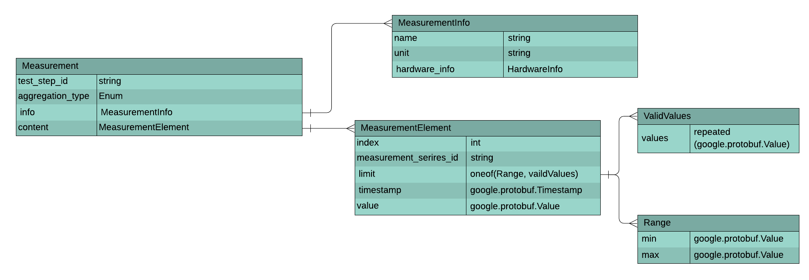

# OCPDiag results model


<!--*

freshness: { owner: 'yuanlinw' reviewed: '2022-03-22' } *-->

## Overview

The OCPDiag result model was first proposed and used inside Google to accommodate
different execution environments and requirements and to improve integration
with vendors during the development of diagnostics for specific hardware. The
model was later introduced to the OCP group as a compliant implementation of a
larger standard that could accelerate cross-company collaboration on hardware
testing and validation.

This document describes the model's result objects, data schema, reference APIs
and best use practices.

## Result objects

###### TestRun


`TestRun` is a single run of a OCPDiag Diagnostic. It is the top-level result
object in the OCPDiag Results Model. In the `TestRun` object, test developers can
report generic information including test name, version, start/end timestamp,
[test status](#test-status-vs-test-result),
[test result](#test-status-vs-test-result), parameters, hostname, hardware
parts, software information, customized tags, logs, and errors. Each of these
reportable attributes is considered a TestRunArtifact.

TestRun also includes one or more [TestSteps](#teststep), which report detailed
diagnostic progress, measurements and hardware health.

###### TestStep


`TestStep` is one logical step in a hardware diagnostic process(`TestRun`). One
`TestRun` can have one or multiple `TestSteps` which can run in parallel or in
series.

The results of the `TestStep` primarily include:

*   providing test executors a clear and unified view of how far the test has run.
*   bundling the correlated result artifacts together for easier lookup and
    analysis

The following image displays an example of step arrangements and how these can
group result artifacts:


Step relationships can represent sequencing, reasoning, parallel processing,
etc. Each artifact within a test step is identified as a `TestStepArtifact`.

###### Diagnosis


`Diagnosis` is a `TestStepArtifact` that provides the health status of a hardware
component. This is differentiated from [`Errors`](#error).

###### Error


`Error` is a result artifact that reports a software, firmware, test, or any other
hardware-unrelated issues. The result type can be either `TestRunArtifact` or
`TestStepArtifact`.

When `Error` is used in `TestRun`, it reports errors that occur when getting the generic test
information (such as, during parameter parsing). When `Error` is used in `TestStep`, it reports
specific procedural errors encountered while running that step.

###### Measurement



`Measurement` is a `TestStepArtifact` that measures hardware health information
(such as, temperature, bandwidth, etc.) that can be used to support a decision in
`Diagnosis`.

###### MeasurementSeries


`MeasurementSeries` is a time-series set of `Measurements` for the same hardware
component. The result type is `TestStepArtifact`.

###### Log

`Log` is a result artifact that provides human-readable text logs for debugging
purposes. The result type can be either `TestRunArtifact` or `TestStepArtifact`, which dumps
logs in the corresponding execution progresses.

`Logs` can have logging levels including `INFO`, `DEBUG`, `WARNING`, `ERROR` and
`FATAL`.

For field details, see [`TestStep` diagram](#teststep).

###### File

`File` is a `TestStepArtifact` that should be uploaded to the test executive's
backend as a record.

For field details, see [`TestStep` diagram](#teststep).

###### ArtifactExtension

`ArtifactExtension` is a `TestStepArtifact` whose definition and format can be
customized by the test developer. The `ArtifactExtension` is usually used for
post-processing, dashboarding, and data collecting when other output artifacts
do not capture sufficient information.

For field details, see [`TestStep` diagram](#teststep).

###### Test Status vs Test Result

`TestStatus` is an Enum that reports whether or not a test is executed properly. Possible values
are `COMPLETE`, `ERROR`, and `SKIPPED`.

`TestResult` is an Enum that reports hardware health. Possible values are `PASS`and
`FAIL`.

`TestResult` only reports valid hardware health when `TestStatus` is `COMPLETE`.
For details on how the reference API calculates the status and results based on
the artifacts, see
[`TestStatus and TestResult Calculation`](results_reference_api.md#test-status-and-result).

## Data schema

The Protobuf format defines the result data schema and `JOSN Lines`(`JSONL`)
formats the output artifacts.

Why JSONL?

*   JSON is highly portable, self-describing - No Metadata needed.
*   Many visualization/validation tools available for JSON.
*   Widely known/expertise across all diagnostic functions.
*   JSON is both human-readable and machine-readable.
*   JSONL, or `Newline-delimited JSON` (`NDJSON`) provides a way to stream JSON
    artifacts for long-running diagnotics.

Why Protobuf?

*   Protobuf provides cross-platform and cross-language libraries.
*   Protobuf3 has canonical mapping to JSON.

Protobuf supports result streaming, time-period artifacts that run over time and
which contain sub-artifacts are initialized and closed with `Begin` and `End`
methods.

See
[results.proto](/ocpdiag/core/results/results.proto)
for detailed proto definition,

###### OutputArtifact

In the Protobuf reference implementation, each artifact is emitted as an
OutputArtifact message.

```proto
message OutputArtifact {
  oneof artifact {
    TestRunArtifact test_run_artifact = 1;
    TestStepArtifact test_step_artifact = 2;
  }
  int32 sequence_number = 3;
  google.protobuf.Timestamp timestamp = 4;
}
```

*   Each artifact has a timestamp.
*   An artifact's sequence number is its index number for data loss detection.

###### TestRunArtifact

`TestRunArtifact` can be one of `TestRunStart`, `TestRunEnd`, `Log`, `Tag` or
`Error`.

```proto
message TestRunArtifact {
  oneof artifact {
    TestRunStart test_run_start = 1;
    TestRunEnd test_run_end = 2;
    Log log = 3;
    Tag tag = 4;
    Error error = 5;
  }
}
```

`TestRunStart` reports the test name, version, parameters, and all the
hardware and software information specified for this diagnostic test.

```proto
message DutInfo {
  string hostname = 1;
  PlatformInfo platform_info = 2;
  // All hardware components diagnosed in this test.
  repeated HardwareInfo hardware_components = 3;
  // All software information diagnosed in this test.
  repeated SoftwareInfo software_infos = 4;
}

message TestRunStart {
  string name = 1;
  string version = 2;
  google.protobuf.Any parameters = 3;
  repeated DutInfo dut_info = 4;
}
```

*   Each `HardwareInfo` registered here generates a `hardware_info_id` used in
    other artifacts (like `Measurement` and `Diagnosis`) to link to this
    hardware component.
*   Each `SoftwareInfo` registered here generates a `software_info_id` used in
    other artifacts (like `Error`) to link to this software component.

`TestRunEnd` reports the test status and results.

```proto
enum TestStatus {
  UNKNOWN = 0;
  COMPLETE = 1;
  ERROR = 2;
  SKIPPED = 3;
}

enum TestResult {
  NOT_APPLICABLE = 0;
  PASS = 1;
  FAIL = 2;
}

message TestRunEnd {
  string name = 1;
  TestStatus status = 2;
  TestResult result = 3;
}
```

###### TestStepArtifact

`TestStepArtifact` can be on of `TestStepStart`, `TestStepEnd`, `Measurement`,
`MeasurementSeriesStart`, `MeasurementSeriesEnd`, `MeasurementElement`,
`Diagnosis`, `Error`, `File`, `Log`, or `ArtifactExtension`. Each artifact
should be linked to its `test_step_id`. In the reference API, the
`test_step_id`s are generated automatically.

```proto
message TestStepArtifact {
  oneof artifact {
    TestStepStart test_step_start = 1;
    TestStepEnd test_step_end = 2;
    Measurement measurement = 3;
    MeasurementSeriesStart measurement_series_start = 4;
    MeasurementSeriesEnd measurement_series_end = 5;
    MeasurementElement measurement_element = 6;
    Diagnosis diagnosis = 7;
    Error error = 8;
    File file = 9;
    Log log = 10;
    ArtifactExtension extension = 11;
  }
  string test_step_id = 12;
}
```

`TestStepStart` has a step name defined and `TestStepEnd` gives the step status.
Note that only `TestRun` has a PASS/FAIL result. `TestStep` only reports
`TestStatus`.

```proto
message TestStepStart {
  string name = 1;
}

message TestStepEnd {
  string name = 1;
  TestStatus status = 2;
}
```

Each step has its own unique `test_step_id` in one `TestRun` to record the steps
and link the step with its artifacts.

###### Diagnosis

```proto
message Diagnosis {
  string symptom = 1;
  enum Type {
    UNKNOWN = 0;
    PASS = 1;
    FAIL = 2;
  }
  Type type = 2;
  string msg = 3;
  repeated string hardware_info_id = 4;
}
```

The `hardware_info_id` is the id registered in `TestRunStart`. If the id is not
registered, the test cannot find the referenced hardware component. In our
reference API, an `Error` artifact with symptom `unregistered-hardware-info`
is reported.
([example](results_reference_api.md#chunk-3-info-is-registered-and-the-diagnostic-phase-begins))

###### Error

```proto
message Error {
  string symptom = 1;
  string msg = 2;
  repeated string software_info_id = 3;
}
```

The `software_info_id` is the id registered in `TestRunStart`. If the id is not
registered, the test can't find the referenced software component. In our
reference API, an `Error` artifact with symptom `unregistered-software-info`
is reported.

###### Measurement & MeasurementSeries

Individual `Measurement` and `MeasurementSeries` artifacts are defined as
follows:

```proto
message MeasurementInfo {
  string name = 1;
  string unit = 2;
  string hardware_info_id = 3;
}

message MeasurementElement {
  int32 index = 1;
  string measurement_series_id = 2;
  google.protobuf.Value value = 3;
  oneof limit {
    Range range = 4;
    ValidValues valid_values = 5;
  }
  google.protobuf.Timestamp dut_timestamp = 6;
}

message Measurement {
  MeasurementInfo info = 1;
  MeasurementElement element = 2;
}

message MeasurementSeriesStart {
  string measurement_series_id = 1;
  MeasurementInfo info = 2;
}

message MeasurementSeriesEnd {
  string measurement_series_id = 1;
  int32 total_measurement_count = 2;
}

```

*   If the `hardware_info_id` filed is not assigned, the default value
    `NOT_APPLICABLE` is applied to indicate that the measurement is not attached
    to a specific HW component. If the id is assigned but the corresponding
    hardware component is not registered, an `Error` artifact with symptom
    `unregistered-hardware-info` is reported.
*   `MeasurementElement` index starts from 0 to calculate measurement element
    count in a measurement series. If an individual `Measurement` (not
    `MeasurementSeries`) is dumped, the index is always 0.
*   `measurement_series_id` in `MeasurementElement` is only needed for elements
    in a MeasurementSeries. If `measurement_series_id` is used in an individual
    measurement, the default value `NOT_APPLICABLE` is applied.
*   Measurement Limit can be a range (minimum + maximum) or a list of valid
    values expected. If neither is assigned the measurement does not report a
    limit.
*   `total_measurement_count` is an alternative to `sequence_number` that can be
    used to detect data loss.

###### Log

```proto
message Log {
  enum Severity {
    INFO = 0;  // Default
    DEBUG = 1;
    WARNING = 2;
    ERROR = 3;
    FATAL = 4;
  }
  Severity severity = 1;
  string text = 2;
}
```

###### File

```proto
message File {
  string upload_as_name = 1;
  string output_path = 2;
  string description = 3;
  string content_type = 4;
  bool is_snapshot = 5;
  repeated Tag tags = 6;
}
```

To ensure that the test executive does not act on critical files that may potentially harm the machine or access the files to which it is not granted access, use the following best practices:

*   Make `output_path` the relative log path on the machine against the
    test working directory.
*   Require the test to copy the snapshot of a certain log file for uploading if
    the file not in the CWD or is dangerous to delete.
    *   You can use `is_snapshot` to indicate the original
        log file. If `is_snapshot` is true, the test informs the executive
        that the test made a copy of the original log file and that
        `output_path` is the copied filepath.
*   The file in the output_path should always be safe to delete after the test
    executive uploads it.

###### ArtifactExtension

```proto
message ArtifactExtension {
  string name = 1;
  google.protobuf.Any extension = 2;
}
```

## Reference APIs

To learn more, run through the [OCPDiag Result Generation API Codelab](results_reference_api.md).

## Best practices


Coming soon!
