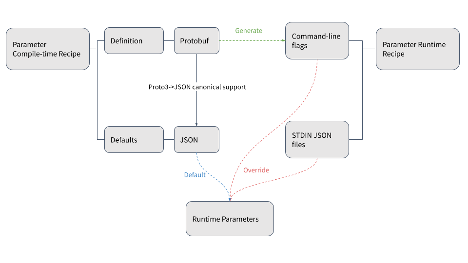
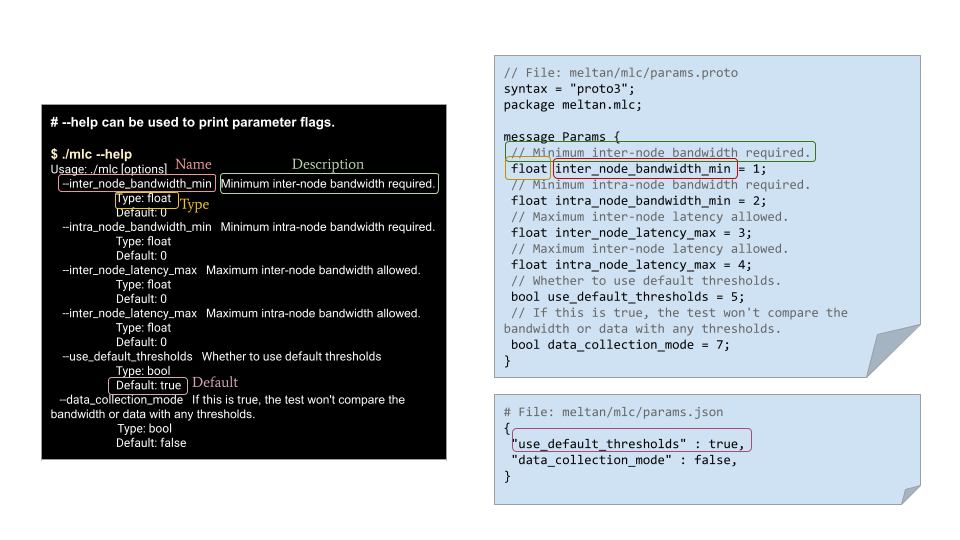

# Meltan parameter model


<!--*
freshness: { owner: 'yuanlinw' reviewed: '2021-09-23' }
*-->

This page describes how to define and use the Meltan parameter model.

## Overview

Test developers sometimes encounter situations in which they need to:

*  reuse paraemters in different environments and use cases.
*  work with complex parameters such as nested-types or lists of values.
*  perform execution-time overrides.


To accommodate these situations, the Meltan framework provides options for:

*  providing a simple help to show parameter flags and defaults.
*  adding a flag to override default values at execution time.
*  override at execution time either by command line CLI or StdIn files.

**Parameter recipe**



## Parameter definition

Meltan uses
[protocol buffers](https://developers.google.com/protocol-buffers/docs/overview)
for parameter definition. Both proto2 and proto3 are supported although proto3
is preferred for its canonical JSON support.

Using proto definition, test developers can define the parameters in an
arbitrary nested way. Following is a sample parameter defition with some
widely-used data types. ([code location](/meltan/core/examples/simple/params.proto))

```proto
syntax = "proto3";

package meltan.simple;

message Params {
  message SubParam {
    // A string subparameter.
    string sub = 1;
    // Another repeated integer subparameter.
    repeated int64 other = 2;
  }

  message Recursive {
    // A recursive member.
    repeated Recursive recursive = 1;
  }

  string foo = 1;
  int32 bar = 2;
  SubParam msg = 3;
  repeated SubParam subs = 4;
  repeated string strings = 5;

  // 7 Numeric Types:
  // Boolean type.
  bool b = 6;
  int32 i32 = 7;  // Int32 type.
  uint32 u32 = 8;
  int64 i64 = 9;
  uint64 u64 = 10;
  float f32 = 11;
  double f64 = 12;

  // Enum
  enum Values {
    DEFAULT = 0;
    FOO = 1;
    BAR = 2;
    BAZ = 3;
  }
  // An enumerated value.
  Values enumerated = 13;

  // Recursive top-level entry.
  Recursive recursive = 14;

  map<string, string> map = 15;
}
```

**Note:** If a proto definition has more than one top-level message, the
`(.meltan.options).params_message` proto file option must be set, as shown in
the following example. Because the package contains two proto definitions
(`SubMessage` and `ParamsMessage`), you specify the test parameter entry by
setting `option (.meltan.options).params_message`

```proto
syntax = "proto3";
package meltan.lib.params.testdata;
import "@meltan/meltan/lib/params/meltan_params.proto";

option (.meltan.options).params_message =
  "meltan.lib.params.testdata.ParamsMessage";
message SubMessage {
  bool wrong_message = 1;
};
message ParamsMessage {
  SubMessage msg = 1;
};
```

## Parameter defaults

Default parameter values are defined as a JSON file. For canonical mapping
between JSON and Proto, please refer to
[the JSON Mapping document](https://developers.google.com/protocol-buffers/docs/proto3#json).

Here is an example default json file for the parameter proto above:
([code location](/meltan/core/examples/simple/params.json))

```json
{
  "foo" : "foo_string",
  "bar" : 1893,
  "msg" : {
    "sub" : "standalone message",
    "other" : [1, 2, 3, 4, 5]
  },
  "subs" : [
    {"sub" : "repeated message 0"},
    {"sub" : "repeated message 1"}
  ],
  "strings" : ["foo", "bar", "baz", "gorp"]
}
```

**Note:** Undefined fields default to
[protobuf default values](https://developers.google.com/protocol-buffers/docs/proto3#default).

## Parameter flags

Parameters defined in
[`params_proto`](/meltan/#get-started) are registered
in the test as flags for overrides. These are called parameter flags.

A `--help` flag is supported. The flag can dump non-parameter flags, parameter
flags, Meltan environment variables, and the JSON-formatted default parameter
values.

The following diagram shows how the different components in parameter flags maps
to the different compile-time parameter receipes.



**Note:** Parameter descriptions are available only when the Meltan executable
is built with the flag `--protocopt=--include_source_info`.

**Example:** `--help` dumps of the `simple` test when no
`--protocopt=--include_source_info` flag is included.

```shell
$: ./simple --help

No flags matched.

Try --helpfull to get a list of all flags or --help=substring shows help for
flags which include specified substring in either in the name, or description or
path.

  Flags from parameter overrides:
    --foo (); type: string;
    --bar (); type: int32;
    --msg (); type: meltan.simple.Params.SubParam;
    --msg.sub (); type: string;
    --msg.other (); type: [int64];
    --msg.other[#] (); type: int64;
    --subs (); type: [meltan.simple.Params.SubParam];
    --subs[#] (); type: meltan.simple.Params.SubParam;
    --subs[#].sub (); type: string;
    --subs[#].other (); type: [int64];
    --subs[#].other[#] (); type: int64;
    --strings (); type: [string];
    --strings[#] (); type: string;
    --b (); type: bool;
    --i32 (); type: int32;
    --u32 (); type: uint32;
    --i64 (); type: int64;
    --u64 (); type: uint64;
    --f32 (); type: float;
    --f64 (); type: double;
    --enumerated (); type: meltan.simple.Params.Values;
    --recursive (); type: meltan.simple.Params.Recursive;
    --recursive.recursive (); type: [meltan.simple.Params.Recursive];
    --recursive.recursive[#] (); type: meltan.simple.Params.Recursive;
    --map (); type: [meltan.simple.Params.MapEntry];
    --map[#] (); type: meltan.simple.Params.MapEntry;
    --map[#].key (); type: string;
    --map[#].value (); type: string;

  Environment Variables:
    MELTAN_STDIN (By default, only read JSON params from redirected stdin in an
      interactive terminal environment. When set, always block reading JSON
      params from stdin.);

  Default Parameters:
    {
     "foo": "foo_string",
     "bar": 1893,
     "msg": {
      "sub": "standalone message",
      "other": [
       "1",
       "2",
       "3",
       "4",
       "5"
      ]
     },
     "subs": [
      {
       "sub": "repeated message 0",
       "other": []
      },
      {
       "sub": "repeated message 1",
       "other": []
      }
     ],
     "strings": [
      "foo",
      "bar",
      "baz",
      "gorp"
     ],
     "b": false,
     "i32": 0,
     "u32": 0,
     "i64": "0",
     "u64": "0",
     "f32": 0,
     "f64": 0,
     "enumerated": "DEFAULT",
     "map": {}
    }
```

## Parameter overrides

You can override default values by using command line flags supported in
`--help` or in a customized JSON file passed in from standard input. Command
line flags can override the stdin JSON file.

**Note:** Flags can override a subfield(`subs[0].sub=\"val1\"`) or the whole
message (`subs="[]"`) for a nested parameter.

A `--dry_run` flag is provided to parse the parameter overrides and print the
final parameter values with the current override combination.

Following are some examples of overrides:

###### With no overrides 

```shell
$: ./simple --dry_run

This test was started with --dry_run. If it was actually run, the raw arguments would have been
/tmp/sar.simple.484791.BMh0zzE2uI/_meltan_test_pkg_simple_launcher.runfiles/google3/third_party/meltan/core/examples/simple/simple_bin
--dry_run
It would be passed the parameters via stdin.
{
 "foo": "foo_string",
 "bar": 1893,
 "msg": {
  "sub": "standalone message",
  "other": [
   "1",
   "2",
   "3",
   "4",
   "5"
  ]
 },
 "subs": [
  {
   "sub": "repeated message 0"
  },
  {
   "sub": "repeated message 1"
  }
 ],
 "strings": [
  "foo",
  "bar",
  "baz",
  "gorp"
 ]
}
```

###### Override by custom JSON file 

```shell
$: cat ./custom_params.json
{foo: "custom_json_override"}
$: ./simple < ./custom_params.json --dry_run
This test was started with --dry_run.If it was actually run, the raw arguments would have been
/tmp/sar.simple.484791.Ye36ZHTy5v/_meltan_test_pkg_simple_launcher.runfiles/google3/third_party/meltan/core/examples/simple/simple_bin --dry_run
It would be passed the parameters via stdin.
{
 "foo": "custom_json_override",
 "bar": 1893,
 "msg": {
  "sub": "standalone message",
  "other": [
   "1",
   "2",
   "3",
   "4",
   "5"
  ]
 },
 "subs": [
  {
   "sub": "repeated message 0"
  },
  {
   "sub": "repeated message 1"
  }
 ],
 "strings": [
  "foo",
  "bar",
  "baz",
  "gorp"
 ]
}
```

**Note:** Standard input override is disabled by default when it is not running
from terminal. Be sure to set the environment variable `MELTAN_STDIN=true` to
enable standard input override when executing remotely.

**Example**

```shell
$: <custom_params.json 2>/dev/null ssh root@localhost MELTAN_STDIN=1 ./simple | grep foo
"foo": "custom_json_override"
```

###### Command line overrides 

Command line overrides can override stdin overrides.

```shell
$: ./simple < ./custom_params.json --foo="cmd_override_foo" --msg.sub="cmd_override_msg_sub" --subs[0]="{\"sub\":\"cmd_override_sub_0\"}" --strings="[]" --dry_run
This test was started with --dry_run.If it was actually run, the raw arguments would have been
/tmp/sar.simple.484791.uXT2KH2n2H/_meltan_test_pkg_simple_launcher.runfiles/google3/third_party/meltan/core/examples/simple/simple_bin --dry_run
It would be passed the parameters via stdin.
{
 "foo": "cmd_override_foo",
 "bar": 1893,
 "msg": {
  "sub": "cmd_override_msg_sub",
  "other": [
   "1",
   "2",
   "3",
   "4",
   "5"
  ]
 },
 "subs": [
  {
   "sub": "cmd_override_sub_0"
  },
  {
   "sub": "repeated message 1"
  }
 ]
}
```

For additional details on overrides, see
[Meltan parameter unit tests](/meltan/lib/params/meltan_parameter_parser_test.cc).
